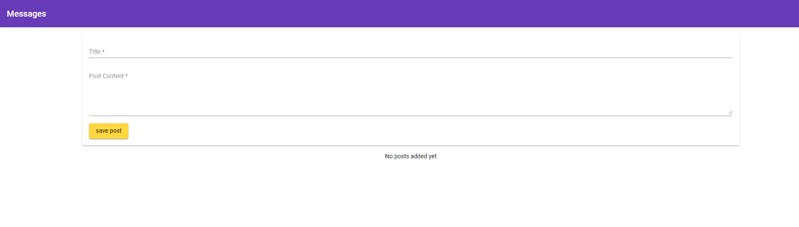

# Meanapp

This is a project in progress developing a messaging app in the MEAN stack.

# Technologies
* MongoDB
* Express
* Angular
* Node

## Development server

Run `ng serve` for a dev server. Navigate to `http://localhost:4200/`. The app will automatically reload if you change any of the source files.

